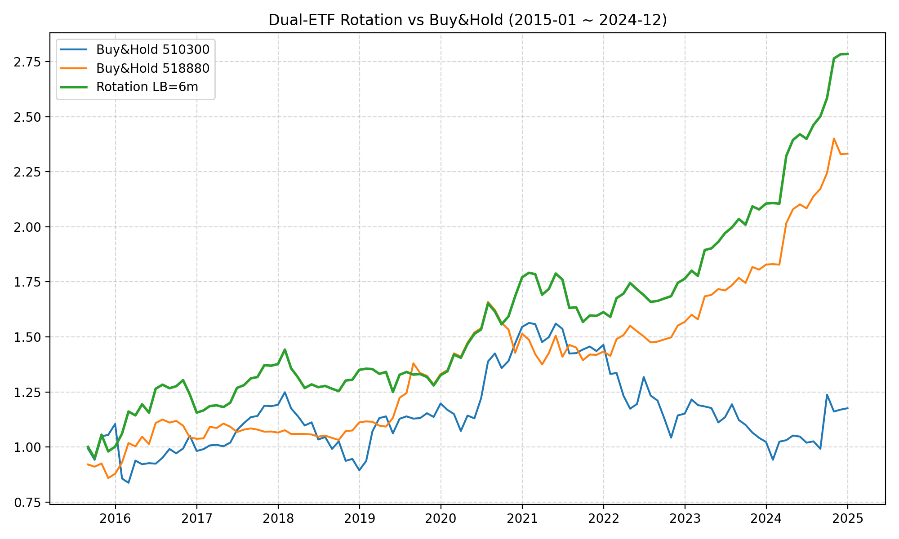
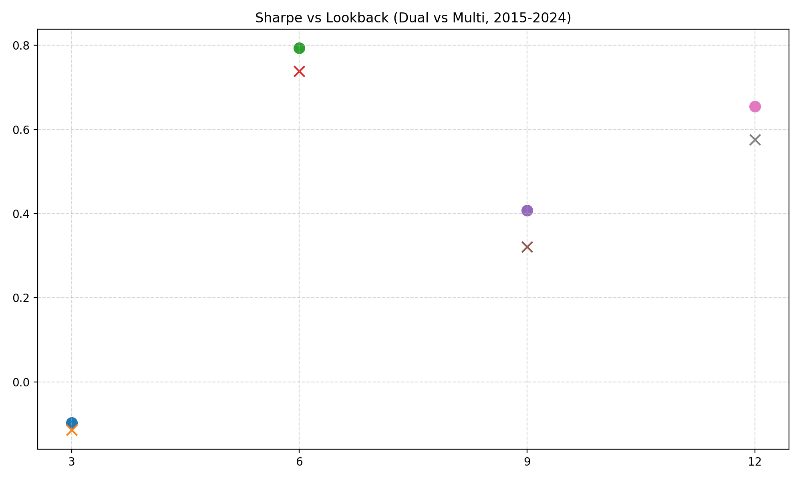
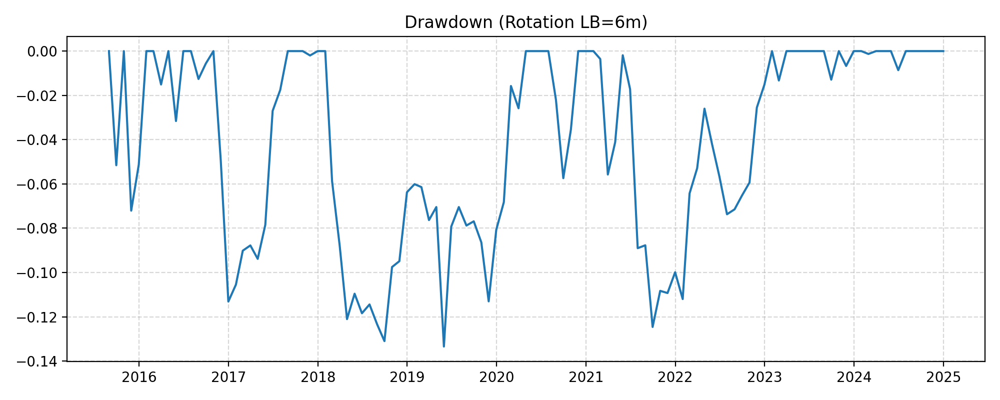

# 📈 Dual-ETF Momentum Rotation Strategy  
### *CSI 300 (510300.SH) + Gold (518880.SH)*  
Momentum-based asset rotation strategy using **Python + Akshare**, with full backtest results and performance analysis.

---

## 🧠 Project Overview

This project implements a **dual-asset momentum rotation model** between:
- **CSI 300 ETF (510300.SH)** — represents the Chinese equity market  
- **Gold ETF (518880.SH)** — represents defensive assets  

The strategy dynamically allocates between the two based on **past N-month momentum (Lookback)**, switching monthly to the asset with stronger relative performance.

> Backtest period: **2015–2024 (10 years)**  
> Data source: [Akshare](https://github.com/akfamily/akshare)

---

## ⚙️ Methodology

### 1️⃣ Dual Rotation Logic  
For each month:
1. Calculate past *N-month* returns of CSI300 and Gold.  
2. Choose the one with higher momentum to hold next month.  
3. Evaluate performance metrics: CAGR, Sharpe, Max Drawdown, Win Rate.

### 2️⃣ Multi Rotation Extension  
Extended version adds **Treasury ETF (511260.SH)** to form  
a *Multi-Asset Rotation* portfolio.

---

## 📊 Backtest Results (2015–2024)

### 🔹 Dual Strategy (CSI300 + Gold)
| Lookback (M) | CAGR | Volatility | Sharpe | Max DD | Win Rate |
|--------------:|------:|-----------:|-------:|--------:|----------:|
| 3 | -0.80% | 15.7% | -0.10 | -21% | 54% |
| 6 | **11.49%** | 12.2% | **0.79** | -13% | 64% |
| 9 | 6.95% | 14.1% | 0.41 | -17% | 60% |
| 12 | 9.32% | 11.6% | 0.65 | -15% | 60% |

> 🏆 **Best Lookback: 6 months**

### 🔹 Multi Strategy (CSI300 + Gold + Bond)
| Lookback (M) | CAGR | Volatility | Sharpe | Max DD | Win Rate |
|--------------:|------:|-----------:|-------:|--------:|----------:|
| 3 | -0.82% | 14.7% | -0.10 | -20% | 54% |
| 6 | **10.53%** | 11.8% | 0.74 | -14% | 63% |
| 9 | 5.61% | 13.9% | 0.34 | -18% | 58% |
| 12 | 8.25% | 11.4% | 0.58 | -16% | 59% |

> ✅ Both outperform Buy & Hold in Sharpe and drawdown control.

---

## 📈 Visualization

**Performance Comparison**



**Sharpe vs Lookback**



**Drawdown**



---

## 🧩 Repository Structure
dual-etf-momentum-rotation/
┣ 📂 strategy/      # Python scripts for backtest & comparison
┣ 📂 results/       # All generated charts and performance metrics
┣ 📂 report/        # Final PDF research report
┣ 📄 README.md      # Project overview (this file)
┣ 📄 LICENSE        # MIT open-source license
┗ 📄 .gitignore

---

## 🪶 How to Run Locally

```bash
# 1. Clone repository
git clone https://github.com/<your-username>/dual-etf-momentum-rotation.git
cd dual-etf-momentum-rotation

# 2. Install dependencies
pip install akshare pandas numpy matplotlib

# 3. Run main backtest
python strategy/dual_rotation_10y_gold_ak.py

# 4. Compare Dual vs Multi rotation
python strategy/compare_dual_vs_multi_ak.py

```
---

## 📄 Full Report (PDF)

📘 **[View the full research report (PDF)](report/Dual-ETF%20Momentum%20Rotation%20Strategy%20(CSI%20300%20+%20Gold).pdf)**

The report includes:
- Research background and strategy design  
- Data source and backtesting method  
- Performance comparison (CAGR, Sharpe, MDD, WinRate)  
- Discussion on Dual vs Multi asset rotation  

---

## 🧠 Insights

- Momentum-based allocation effectively reduces drawdowns.  
- 6-month lookback provides a stable trade-off between responsiveness and noise.  
- Adding bonds improves downside protection but slightly lowers CAGR.  

---

## ⚖️ License

This project is licensed under the [MIT License](./LICENSE).

---

## 🌟 Author

**Yao Xintong**  
Economics and Business Economics, University of Amsterdam  

📬 GitHub Profile: [https://github.com/627378329](https://github.com/627378329)
